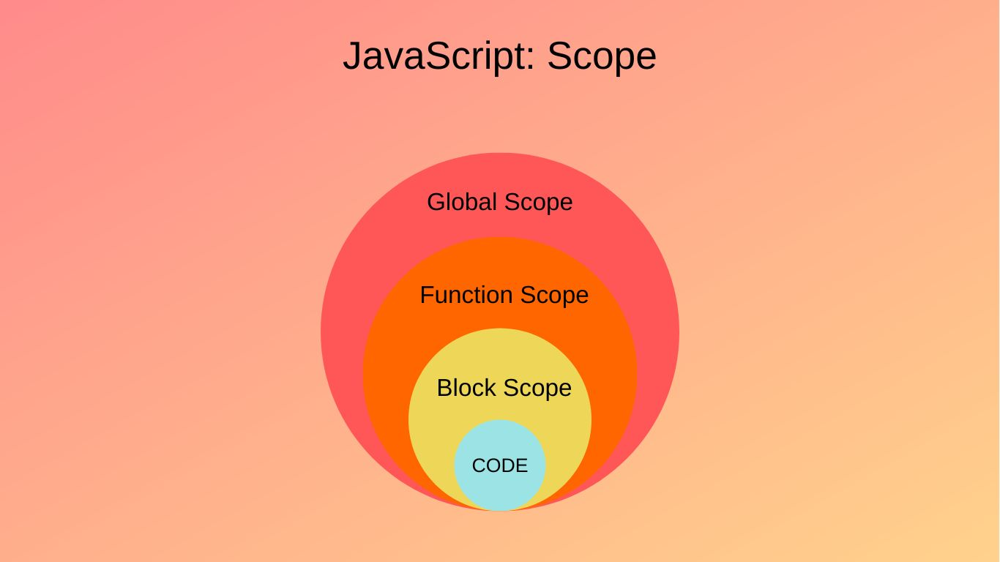
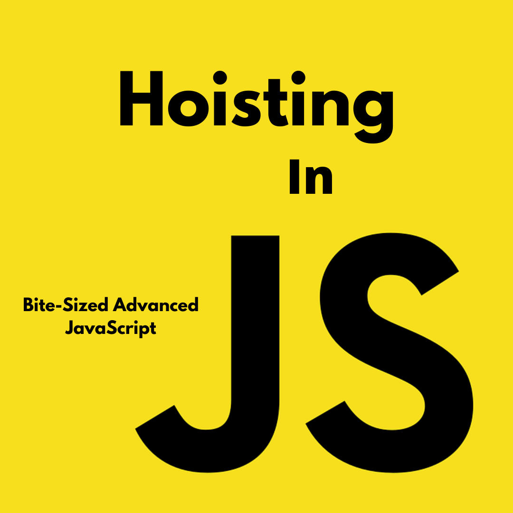

# Scope - ограниченный участок 
 
 > #   1. GLOBAL-SCOPE  
 ##  В JavaScript есть только одна глобальная область. Область за пределами всех функций считается глобальной областью, и переменные, определенные в глобальной области, могут быть доступны и изменены в любых других областях.5

> # 2. FUNCTION-SCOPE
 ## В JavaScript есть область действия функции: каждая функция создает новую область действия. Внутри глобального скопа .

 >  # 3. Block scope
 ## 1. for && if
 ## Например внутри Block-Scope написали функцию и мы можем его вызвать только внутри этого блока  
 
 > # 1. Что такое Hoisting ?
 * ## Hoisting - это  механизмф при котором мы можем вызвать функцию или переменную  до обЪявления .                                       
 * ## Работает только в function declaration
